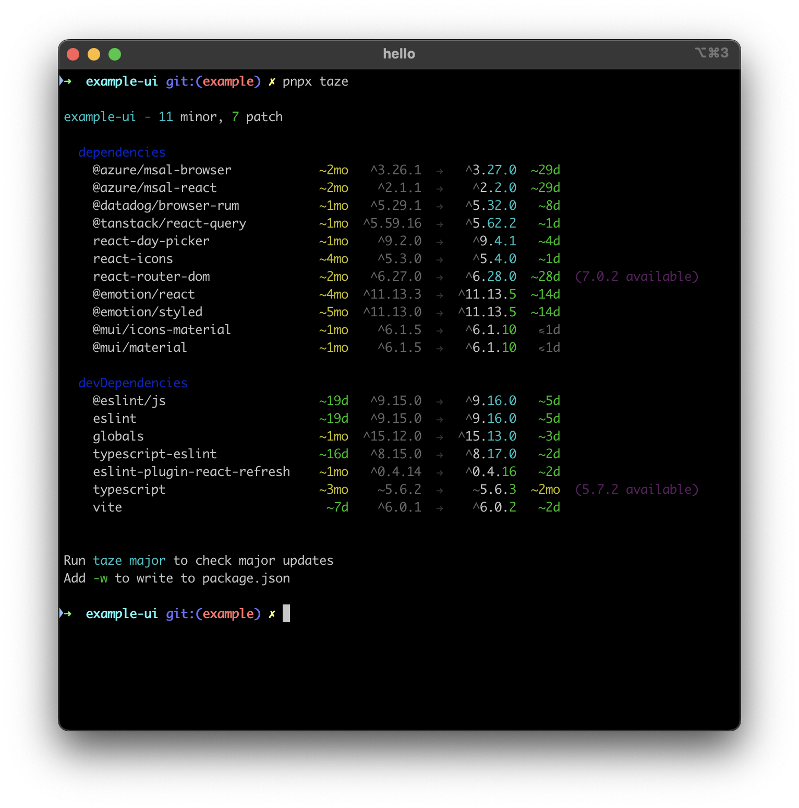
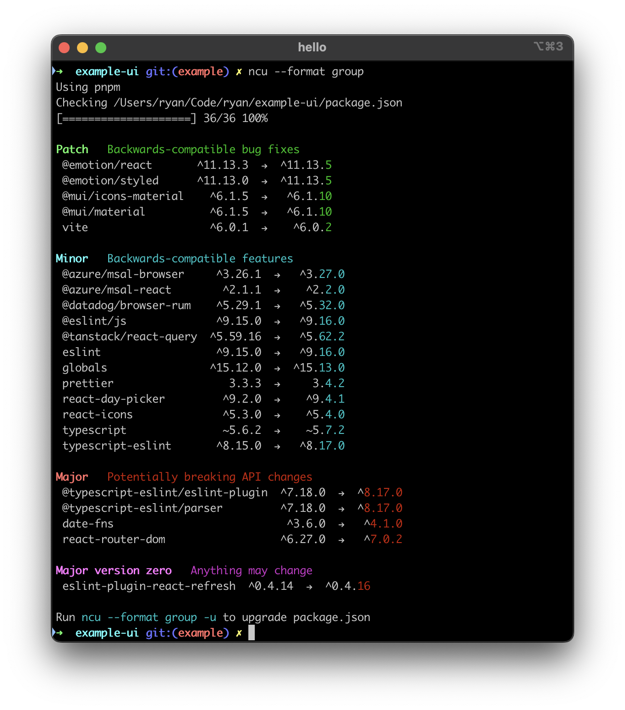

I like using ncu, see my original [npm-check-updates](/posts/npm-check-updates) post and [ncu-skip-pinned-versions](/posts/ncu-skip-pinned-versions) post. Despite that, I still look out for alternative tooling that might perform better.

Here's one such tool: [taze](https://www.npmjs.com/package/taze). 

> (/ta:zei/, fresh in Persian)
> A modern cli tool that keeps your deps fresh

At a high level, here's what I like about `taze`:

- suitably runnable through pnpx (npx)
    - ⭐️ no global installation necessary
- reasonable defaults
    - ⭐️ respects existing package.json version ranges, but also softly informs of major upgrades if available
- readable out of the box
    - ⭐️ aligned columns
- dry run first
    - uses a `-w` flag to confirm rewriting the `package.json` file

Aside from that, all it does is rewrite the package.json accordingly.

---

Here's the output for a reasonably maintained codebase. (The weight of the ecosystem churn is heavy, isn't it?)

Using `taze`:



```
➜  example-ui git:(example) ✗ pnpx taze

example-ui - 11 minor, 7 patch

  dependencies
    @azure/msal-browser            ~2mo   ^3.26.1  →   ^3.27.0  ~29d
    @azure/msal-react              ~2mo    ^2.1.1  →    ^2.2.0  ~29d
    @datadog/browser-rum           ~1mo   ^5.29.1  →   ^5.32.0   ~8d
    @tanstack/react-query          ~1mo  ^5.59.16  →   ^5.62.2   ~1d
    react-day-picker               ~1mo    ^9.2.0  →    ^9.4.1   ~4d
    react-icons                    ~4mo    ^5.3.0  →    ^5.4.0   ~1d
    react-router-dom               ~2mo   ^6.27.0  →   ^6.28.0  ~28d  (7.0.2 available)
    @emotion/react                 ~4mo  ^11.13.3  →  ^11.13.5  ~14d
    @emotion/styled                ~5mo  ^11.13.0  →  ^11.13.5  ~14d
    @mui/icons-material            ~1mo    ^6.1.5  →   ^6.1.10   ⩽1d
    @mui/material                  ~1mo    ^6.1.5  →   ^6.1.10   ⩽1d

  devDependencies
    @eslint/js                     ~19d   ^9.15.0  →   ^9.16.0   ~5d
    eslint                         ~19d   ^9.15.0  →   ^9.16.0   ~5d
    globals                        ~1mo  ^15.12.0  →  ^15.13.0   ~3d
    typescript-eslint              ~16d   ^8.15.0  →   ^8.17.0   ~2d
    eslint-plugin-react-refresh    ~1mo   ^0.4.14  →   ^0.4.16   ~2d
    typescript                     ~3mo    ~5.6.2  →    ~5.6.3  ~2mo  (5.7.2 available)
    vite                            ~7d    ^6.0.1  →    ^6.0.2   ~2d


Run taze major to check major updates
Add -w to write to package.json
```

Here's the same codebase with scanned with `ncu`:



```
➜  example-ui git:(example) ✗ ncu --format group
Using pnpm
Checking /Users/ryan/Code/ryan/example-ui/package.json
[====================] 36/36 100%

Patch   Backwards-compatible bug fixes
 @emotion/react       ^11.13.3  →  ^11.13.5
 @emotion/styled      ^11.13.0  →  ^11.13.5
 @mui/icons-material    ^6.1.5  →   ^6.1.10
 @mui/material          ^6.1.5  →   ^6.1.10
 vite                   ^6.0.1  →    ^6.0.2

Minor   Backwards-compatible features
 @azure/msal-browser     ^3.26.1  →   ^3.27.0
 @azure/msal-react        ^2.1.1  →    ^2.2.0
 @datadog/browser-rum    ^5.29.1  →   ^5.32.0
 @eslint/js              ^9.15.0  →   ^9.16.0
 @tanstack/react-query  ^5.59.16  →   ^5.62.2
 eslint                  ^9.15.0  →   ^9.16.0
 globals                ^15.12.0  →  ^15.13.0
 prettier                  3.3.3  →     3.4.2
 react-day-picker         ^9.2.0  →    ^9.4.1
 react-icons              ^5.3.0  →    ^5.4.0
 typescript               ~5.6.2  →    ~5.7.2
 typescript-eslint       ^8.15.0  →   ^8.17.0

Major   Potentially breaking API changes
 @typescript-eslint/eslint-plugin  ^7.18.0  →  ^8.17.0
 @typescript-eslint/parser         ^7.18.0  →  ^8.17.0
 date-fns                           ^3.6.0  →   ^4.1.0
 react-router-dom                  ^6.27.0  →   ^7.0.2

Major version zero   Anything may change
 eslint-plugin-react-refresh  ^0.4.14  →  ^0.4.16

Run ncu --format group -u to upgrade package.json
```

The output between `taze` and `ncu` shows similar data, but with distinct flavors. The patch/minor/major break down of ncu is informative, but at the same time annoying because upgrading majors is much less a maintenance task, and not really a useful default. The dependencies vs devDependencies break down of taze is useful (build time dependencies are less of a security risk in most cases). The relative dates for "how old the existing version is" and "how young the new version is" are useful gauges for churn and prioritization.

These days, I am trialing `taze` as a primary dependency update tool. I still occasionally use `ncu` just to double check though. There's no real loss in using both for now, and if you decide one is better than the other, that's fine too.